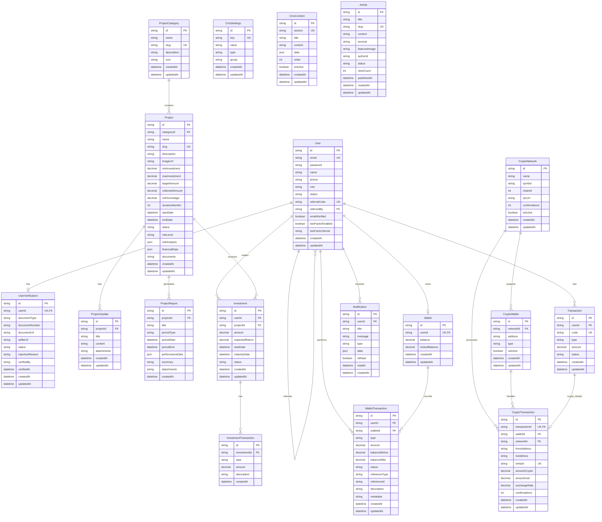

# Mubinyx Database ERD (Entity Relationship Diagram)

## Overview
Database ini menggunakan SQLite dengan Prisma ORM untuk platform investasi Mubinyx.

## ERD Diagram (Mermaid)

## Table Descriptions

### 🧑‍💼 **User Management**
- **User**: Core user table with authentication, roles, and referral system
- **UserVerification**: KYC verification documents and status

### 🏗️ **Project Management**
- **ProjectCategory**: Investment project categories (Real Estate, Tech, etc.)
- **Project**: Investment projects with financial details and risk analysis
- **ProjectUpdate**: Regular updates about project progress
- **ProjectReport**: Performance reports for projects

### 💰 **Investment System**
- **Investment**: User investments in projects
- **InvestmentTransaction**: Transaction history for investments

### 👛 **Wallet System**
- **Wallet**: User wallet with balance tracking
- **WalletTransaction**: All wallet transactions (deposits, withdrawals, etc.)

### 🪙 **Crypto System**
- **CryptoNetwork**: Supported blockchain networks
- **CryptoWallet**: Crypto wallet addresses
- **Transaction**: General transaction records
- **CryptoTransaction**: Detailed crypto transaction data

### 🔔 **Communication**
- **Notification**: User notifications system

### 📝 **Content Management**
- **CmsSettings**: Application configuration settings
- **CmsContent**: Dynamic content management
- **Article**: Blog/news articles

## Key Features

### 🔐 **Security Features**
- Two-factor authentication support
- Email verification system
- Role-based access control (USER, ADMIN, SUPER_ADMIN)

### 💳 **Financial Features**
- Multi-decimal precision for amounts
- Balance tracking with before/after states
- Comprehensive transaction logging
- ROI calculation and tracking

### 🌐 **Crypto Integration**
- Multi-network support
- Transaction confirmation tracking
- Exchange rate recording
- Hash verification

### 📊 **Analytics**
- Performance tracking
- Risk analysis storage
- Financial data JSON fields
- View count tracking

## Database Statistics
- **Total Tables**: 16
- **Core Entities**: 16
- **Relationships**: 25+
- **Database Type**: SQLite
- **ORM**: Prisma

---
*Generated on: July 16, 2025*
*Version: 1.0*
