# Mubinyx System Flowchart

## Overview
Flowchart ini menggambarkan alur kerja sistem Mubinyx, sebuah platform investasi dengan integrasi cryptocurrency.

## Main System Flow

## User Registration & Authentication Flow

```mermaid
flowchart TD
    A[👤 New User] --> B[📝 Fill Registration Form]
    B --> C{Valid Data?}
    C -->|No| D[❌ Show Validation Errors]
    D --> B
    C -->|Yes| E[💾 Create User Account]
    E --> F[📧 Send Verification Email]
    F --> G[📱 User Checks Email]
    G --> H[🔗 Click Verification Link]
    H --> I[✅ Email Verified]
    I --> J[🔐 User Can Login]
    
    J --> K[📝 Enter Credentials]
    K --> L{Valid Login?}
    L -->|No| M[❌ Invalid Credentials]
    M --> K
    L -->|Yes| N{2FA Enabled?}
    N -->|No| O[✅ Login Success]
    N -->|Yes| P[📱 Enter 2FA Code]
    P --> Q{Valid 2FA?}
    Q -->|No| R[❌ Invalid 2FA]
    R --> P
    Q -->|Yes| O
    O --> S[🏠 Redirect to Dashboard]
```

## KYC Verification Flow

```mermaid
flowchart TD
    A[👤 User] --> B[📋 Start KYC Process]
    B --> C[📄 Upload ID Document]
    C --> D[🤳 Upload Selfie]
    D --> E[💾 Submit KYC Data]
    E --> F[⏳ Pending Review]
    F --> G[👨‍💼 Admin Reviews]
    G --> H{KYC Valid?}
    H -->|Yes| I[✅ KYC Approved]
    H -->|No| J[❌ KYC Rejected]
    J --> K[📝 Rejection Reason]
    K --> L[📧 Notify User]
    L --> M[🔄 User Can Resubmit]
    M --> B
    I --> N[📧 Approval Notification]
    N --> O[🎉 Full Platform Access]
```

## Investment Flow

```mermaid
flowchart TD
    A[👤 Verified User] --> B[🏗️ Browse Projects]
    B --> C[📊 View Project Details]
    C --> D{Interested?}
    D -->|No| B
    D -->|Yes| E[💰 Check Investment Limits]
    E --> F{Within Limits?}
    F -->|No| G[⚠️ Show Limit Warning]
    G --> C
    F -->|Yes| H[💳 Enter Investment Amount]
    H --> I{Sufficient Balance?}
    I -->|No| J[💰 Deposit Required]
    J --> K[Top Up Wallet]
    K --> H
    I -->|Yes| L[📝 Confirm Investment]
    L --> M[💾 Create Investment Record]
    M --> N[💸 Deduct from Wallet]
    N --> O[📧 Investment Confirmation]
    O --> P[📊 Track Investment Progress]
```

## Wallet & Transaction Flow

```mermaid
flowchart TD
    A[👤 User] --> B[👛 Access Wallet]
    B --> C{Action Type?}
    C -->|Deposit| D[💰 Deposit Flow]
    C -->|Withdraw| E[💸 Withdrawal Flow]
    C -->|Transfer| F[🔄 Transfer Flow]
    
    %% Deposit Flow
    D --> G{Payment Method?}
    G -->|Bank Transfer| H[🏦 Bank Deposit]
    G -->|Crypto| I[🪙 Crypto Deposit]
    
    H --> J[📝 Upload Proof]
    J --> K[⏳ Pending Verification]
    K --> L[👨‍💼 Admin Reviews]
    L --> M{Valid?}
    M -->|Yes| N[✅ Balance Updated]
    M -->|No| O[❌ Rejected]
    
    I --> P[🔗 Generate Crypto Address]
    P --> Q[📱 User Sends Crypto]
    Q --> R[🔄 Blockchain Confirmation]
    R --> S{Confirmed?}
    S -->|Yes| N
    S -->|No| T[⏳ Wait for Confirmations]
    T --> R
    
    %% Withdrawal Flow
    E --> U{KYC Verified?}
    U -->|No| V[❌ KYC Required]
    U -->|Yes| W[💸 Enter Amount]
    W --> X{Sufficient Balance?}
    X -->|No| Y[❌ Insufficient Funds]
    X -->|Yes| Z[📝 Withdrawal Request]
    Z --> AA[👨‍💼 Admin Approval]
    AA --> BB{Approved?}
    BB -->|Yes| CC[💰 Process Payment]
    BB -->|No| DD[❌ Request Rejected]
    CC --> EE[✅ Withdrawal Complete]
```

## Admin Transaction Approval Flow

```mermaid
flowchart TD
    A[👨‍💼 Admin] --> B[📋 View Pending Transactions]
    B --> C[🔍 Review Transaction Details]
    C --> D[👤 Check User Information]
    D --> E[📄 Verify Documents]
    E --> F{Transaction Valid?}
    F -->|No| G[❌ Reject Transaction]
    F -->|Yes| H[✅ Approve Transaction]
    
    G --> I[📝 Add Rejection Reason]
    I --> J[📧 Notify User]
    J --> K[💾 Update Transaction Status]
    
    H --> L[💰 Process Transaction]
    L --> M[📧 Notify User]
    M --> N[💾 Update Balances]
    N --> O[📊 Generate Transaction Record]
```

## Crypto Payment Flow

```mermaid
flowchart TD
    A[👤 User] --> B[🪙 Select Crypto Payment]
    B --> C[🌐 Choose Network]
    C --> D[💰 Enter Amount]
    D --> E[🔗 Generate Wallet Address]
    E --> F[📱 Display QR Code]
    F --> G[👤 User Sends Crypto]
    G --> H[🔄 Monitor Blockchain]
    H --> I{Transaction Found?}
    I -->|No| J[⏳ Keep Monitoring]
    J --> H
    I -->|Yes| K[📊 Check Confirmations]
    K --> L{Enough Confirmations?}
    L -->|No| M[⏳ Wait for More]
    M --> K
    L -->|Yes| N[💱 Calculate USD Value]
    N --> O[💰 Update User Balance]
    O --> P[📧 Payment Confirmation]
    P --> Q[📊 Record Transaction]
```

## Notification System Flow

```mermaid
flowchart TD
    A[🎯 System Event] --> B{Event Type?}
    B -->|User Registration| C[📧 Welcome Email]
    B -->|KYC Status| D[📧 KYC Notification]
    B -->|Transaction| E[📧 Transaction Alert]
    B -->|Investment| F[📧 Investment Update]
    B -->|Security| G[🔒 Security Alert]
    
    C --> H[💾 Save to Database]
    D --> H
    E --> H
    F --> H
    G --> H
    
    H --> I[📱 Push to User]
    I --> J[🔔 In-App Notification]
    J --> K{User Online?}
    K -->|Yes| L[📲 Real-time Display]
    K -->|No| M[💾 Queue for Later]
```

## System Architecture Overview

```mermaid
flowchart TB
    subgraph "Frontend (Next.js)"
        A[🖥️ User Interface]
        B[📱 Admin Panel]
        C[🔐 Authentication]
        D[📊 Dashboard Components]
    end
    
    subgraph "Backend (NestJS)"
        E[🛡️ Auth Module]
        F[👤 User Module]
        G[💰 Wallet Module]
        H[🏗️ Project Module]
        I[📋 KYC Module]
        J[🔔 Notification Module]
    end
    
    subgraph "Database (SQLite + Prisma)"
        K[👥 Users]
        L[💸 Transactions]
        M[🏗️ Projects]
        N[👛 Wallets]
        O[🪙 Crypto Data]
    end
    
    subgraph "External Services"
        P[📧 Email Service]
        Q[🌐 Blockchain APIs]
        R[💱 Exchange Rate APIs]
    end
    
    A --> E
    B --> F
    C --> E
    D --> G
    
    E --> K
    F --> K
    G --> N
    H --> M
    I --> K
    J --> P
    
    G --> Q
    G --> R
```

## Key System Features

### 🔒 **Security Layer**
- JWT Authentication
- Two-Factor Authentication
- Role-based Access Control
- Email Verification
- Transaction Approval Workflow

### 💰 **Financial Management**
- Multi-currency Wallet System
- Crypto Payment Integration
- Investment Tracking
- ROI Calculations
- Transaction History

### 🏗️ **Project Management**
- Project Categories
- Investment Limits
- Progress Tracking
- Performance Reports
- Updates & Communications

### 👥 **User Management**
- KYC Verification
- User Profiles
- Referral System
- Notification Preferences
- Activity Tracking

### 🪙 **Crypto Integration**
- Multi-network Support
- Real-time Price Tracking
- Blockchain Monitoring
- Confirmation Tracking
- Exchange Rate Management

---
*Generated on: July 16, 2025*
*Version: 1.0*
