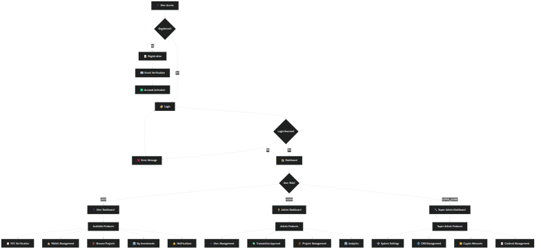
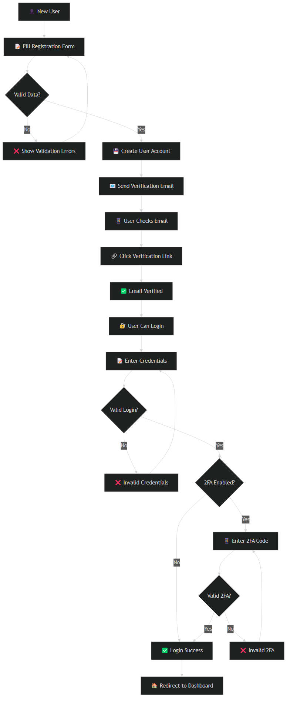
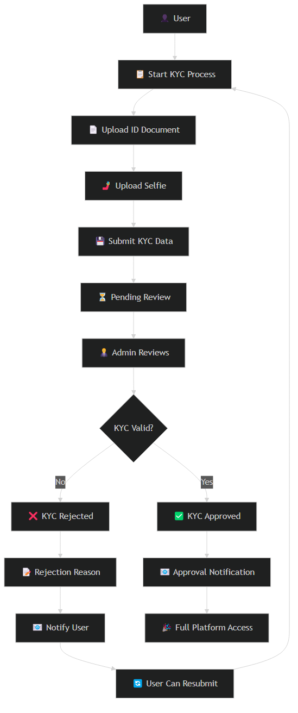
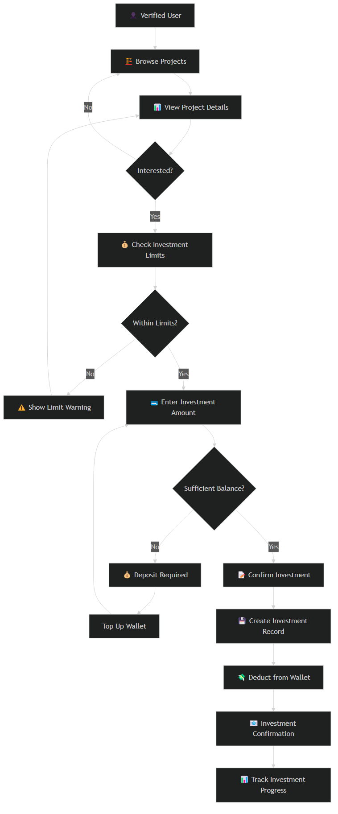
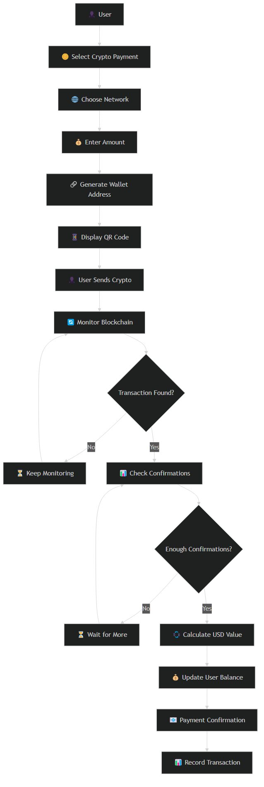
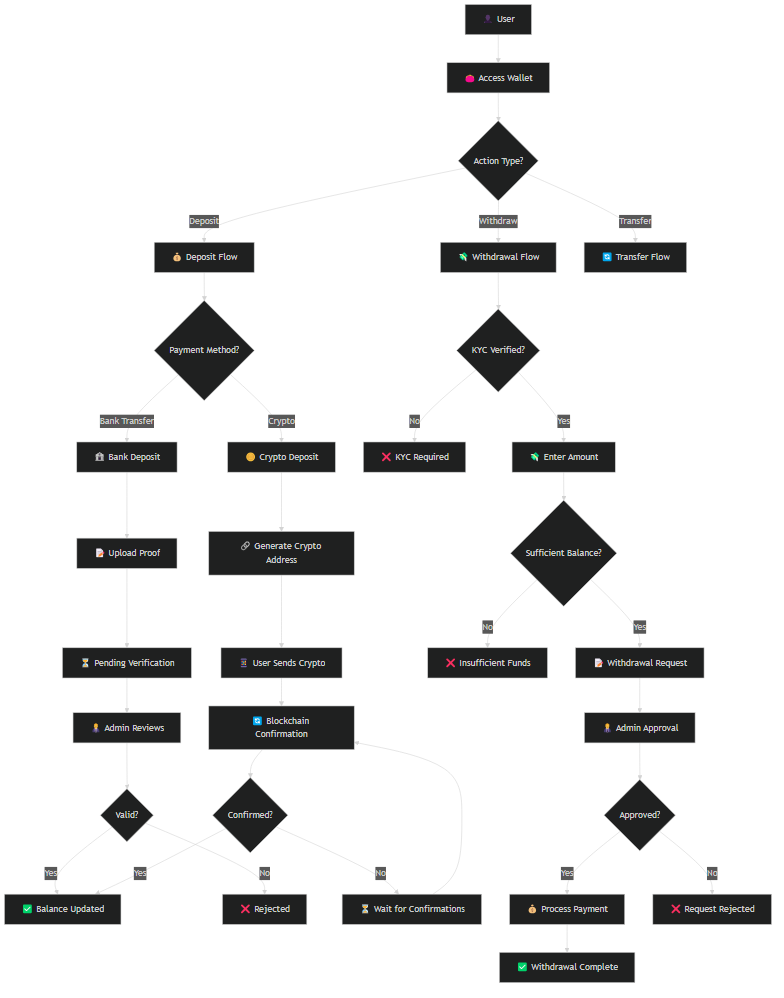
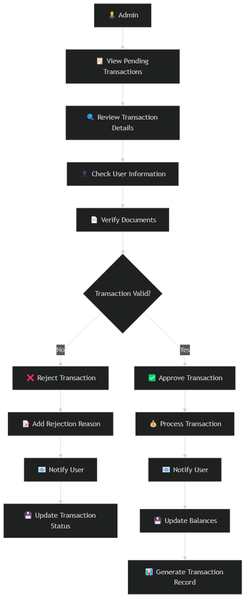
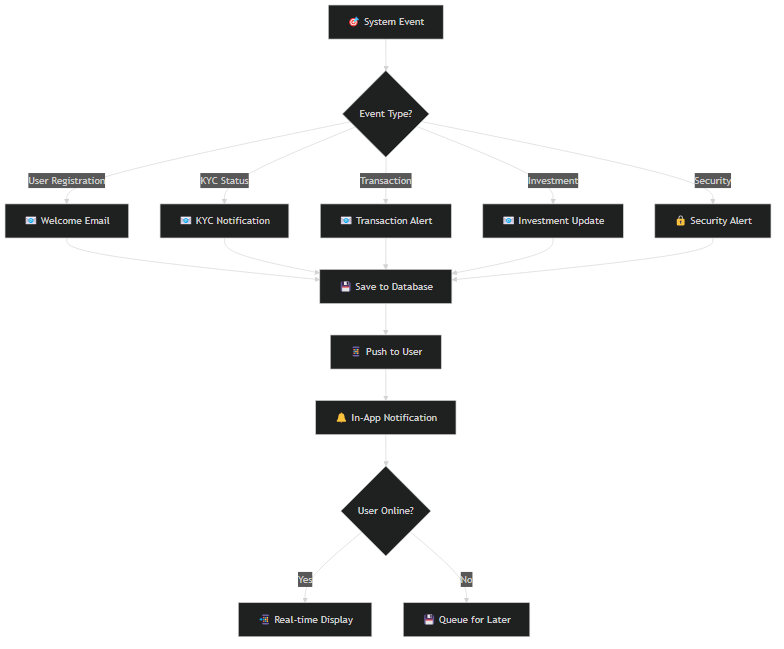
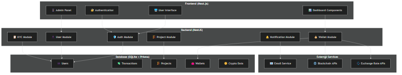

# 📊 Mubinyx Flowchart Images

## 🎯 Generated Flowchart Images

Berikut adalah gambar-gambar flowchart sistem Mubinyx yang telah dibuat:

### 1. 🏠 **Main System Flow**

- **File:** `main-system-flow.png`
- **Deskripsi:** Alur utama sistem dari akses user hingga dashboard berdasarkan role

### 2. 📝 **Registration & Authentication Flow**  

- **File:** `registration-flow.png`
- **Deskripsi:** Proses registrasi user, verifikasi email, dan login dengan 2FA

### 3. 📋 **KYC Verification Flow**

- **File:** `kyc-flow.png`
- **Deskripsi:** Alur verifikasi identitas lengkap dengan upload dokumen

### 4. 🏗️ **Investment Flow**

- **File:** `investment-flow.png`
- **Deskripsi:** Proses investasi dari browse project hingga tracking

### 5. 🪙 **Crypto Payment Flow**

- **File:** `crypto-payment-flow.png`
- **Deskripsi:** Alur pembayaran cryptocurrency dengan monitoring blockchain

### 6. 👛 **Wallet & Transaction Flow**

- **File:** `wallet-transaction-flow.png`
- **Deskripsi:** Manajemen wallet: deposit, withdrawal, transfer dengan berbagai metode pembayaran

### 7. 👨‍💼 **Admin Transaction Approval Flow**

- **File:** `admin-transaction-approval.png`
- **Deskripsi:** Workflow persetujuan transaksi oleh admin dengan proses verifikasi

### 8. 🔔 **Notification System Flow**

- **File:** `notification-system.png`
- **Deskripsi:** Sistem notifikasi untuk berbagai event dengan push notification

### 9. 🏗️ **System Architecture Overview**

- **File:** `system-architecture.png`
- **Deskripsi:** Arsitektur sistem keseluruhan dengan komponen frontend, backend, database, dan external services

## 📋 **Image Specifications**

- **Format:** PNG
- **Theme:** Dark theme with white background
- **Resolution:** High resolution untuk dokumentasi
- **Generated by:** Mermaid CLI (@mermaid-js/mermaid-cli)

## 🔧 **How Images Were Generated**

```bash
# Install Mermaid CLI globally
npm install -g @mermaid-js/mermaid-cli

# Generate each flowchart image
mmdc -i ./flowchart-sources/main-system-flow.mmd -o ./flowchart-images/main-system-flow.png -t dark -b white
mmdc -i ./flowchart-sources/registration-flow.mmd -o ./flowchart-images/registration-flow.png -t dark -b white
mmdc -i ./flowchart-sources/kyc-flow.mmd -o ./flowchart-images/kyc-flow.png -t dark -b white
mmdc -i ./flowchart-sources/investment-flow.mmd -o ./flowchart-images/investment-flow.png -t dark -b white
mmdc -i ./flowchart-sources/crypto-payment-flow.mmd -o ./flowchart-images/crypto-payment-flow.png -t dark -b white
mmdc -i ./flowchart-sources/wallet-transaction-flow.mmd -o ./flowchart-images/wallet-transaction-flow.png -t dark -b white
mmdc -i ./flowchart-sources/admin-transaction-approval.mmd -o ./flowchart-images/admin-transaction-approval.png -t dark -b white
mmdc -i ./flowchart-sources/notification-system.mmd -o ./flowchart-images/notification-system.png -t dark -b white
mmdc -i ./flowchart-sources/system-architecture.mmd -o ./flowchart-images/system-architecture.png -t dark -b white
```

## 🎨 **Additional Flowcharts Available**

✅ **All flowcharts have been generated!** Semua flowchart dari `SYSTEM_FLOWCHART.md` telah berhasil dikonversi menjadi gambar PNG.

## 📁 **File Structure**

```
flowchart-images/
├── README.md (this file)
├── main-system-flow.png
├── registration-flow.png
├── kyc-flow.png
├── investment-flow.png
├── crypto-payment-flow.png
├── wallet-transaction-flow.png
├── admin-transaction-approval.png
├── notification-system.png
└── system-architecture.png

flowchart-sources/
├── main-system-flow.mmd
├── registration-flow.mmd
├── kyc-flow.mmd
├── investment-flow.mmd
├── crypto-payment-flow.mmd
├── wallet-transaction-flow.mmd
├── admin-transaction-approval.mmd
├── notification-system.mmd
└── system-architecture.mmd
```

## 💡 **Usage Tips**

1. **For Documentation:** Use PNG files directly in documentation
2. **For Presentations:** Convert to SVG for better scaling
3. **For Web:** Optimize PNG files for faster loading
4. **For Print:** Use high DPI settings when generating

## 🔗 **Alternative Methods**

1. **Mermaid Live Editor:** https://mermaid.live
2. **VS Code Extension:** Markdown Preview Mermaid Support
3. **Draw.io:** Import mermaid code for editing
4. **Kroki:** Online diagram service

---
*Generated on: July 16, 2025*
*Mubinyx Flowchart Images v1.0*
